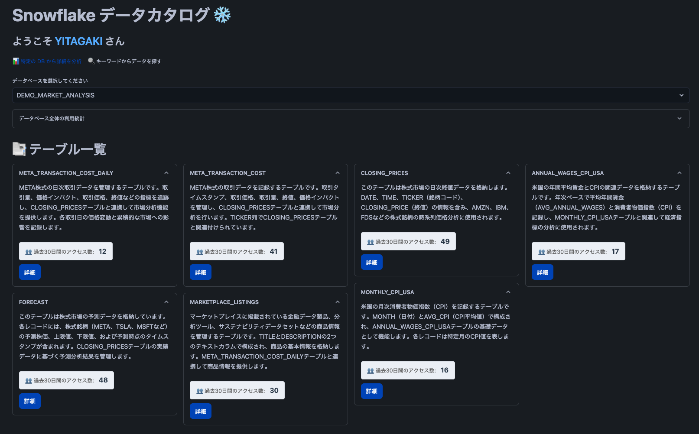

# データカタログアプリの概要
ここに掲載されているサンプルコードは参照目的でのみ提供し、このコードはいかなる保証も伴わないことにご注意ください。
サンプルコードの使用に関するサポートは提供しません。

Copyright (c) 2025 Snowflake Inc. All Rights Reserved.

## 目的
データカタログアプリは Snowflake に溜めたデータを幅広く活用していくために作っています。このアプリは大きく3つの機能がありメタデータ生成機能(run.py)、管理機能(manage.py)、カタログ機能(catalog.py)から成ります。
メタデータ生成機能ではデータベースまたはスキーマに含まれる各テーブルの自然言語記述を生成し、コメント生成機能ではチームメンバーが容易に検索、レビュー、修正、および検索ができます。コメント生成の機能は[こちらのコード](https://github.com/Snowflake-Labs/sfguide-data-crawler)を参考に修正を行なっています。
管理機能では生成されたメタデータの確認や編集、データカタログテーブルへ結果の反映を行います。
カタログ機能ではテーブルの検索、LLM によるテーブルの詳細説明と分析アイデアの提示、マーケットプレイスで公開されている類似外部データの提示を行いユーザのデータ活用を促進します。

# 利用方法
## 環境のセットアップ
SQL ファイル `setup.sql` を実行することで、Streamlit in Snowflake にデプロイされます。ファイルの内容は、Snowsight SQL ワークシートにコピー＆ペーストするか、Snowflake 拡張機能を備えた [VSCode](https://docs.snowflake.com/en/user-guide/vscode-ext) または [SnowCLI](https://docs.snowflake.com/en/developer-guide/snowflake-cli-v2/index) を介して実行できます。ファイルが実行されると、アプリケーションは Snowsight の Streamlit メニューから利用可能になります。
Snowsightからセットアップを行う場合は `setup.sql` 内に記載されているPUTコマンドを参考にして、DATA_CATALOG.TABLE_CATALOG.SRC_FILES にコードをドラッグ＆ドロップでアップロードしてください。

## セットアップ後の流れ
まず `run` ページを開いてメタデータを生成します。
その後 `manage` ページで生成されたデータを確認した後、問題なければ送信ボタンを押してデータを反映します。
最後に `catalog` ページで特定の DB を選択してテーブルデータの情報を取得したり、キーワード検査を通じて欲しいデータを探すことができます。
 
## Streamlit UI のイメージ
catalog ページの画面     |manage ページの画面     | run ページの画面
:--------------------:|:--------------------:|:-------------------------:
||

３つのStreamlitのコードを用意しています。
- `catalog`: テーブルの検索、LLM によるテーブルの詳細説明と分析アイデアの提示、マーケットプレイスで公開されている外部データの類似検索と提示。
- `manage`: テーブルの説明を検索、レビュー、および修正します。
- `run`: 新しいデータベースまたはスキーマ (あるいはその両方) を指定してクロールします。

# 補足
## メタデータの生成
LLM に渡されるプロンプトには、Snowflake テーブルのデータベース名、スキーマ名、テーブル名、カラム名、テーブルコメント、およびテーブルデータのサンプルが含まれます。
ユーザー指定のデータベースまたはスキーマをクロールする場合、ユーティリティを実行している現在のユーザーロールが読み取り可能なすべてのテーブルとビューが含まれます。テーブルの閲覧は、標準的な Snowflake ロールベースのアクセス制御に従います。

## 使用する LLMs
`catalog.py` においてデフォルトで `Claude 3.5 Sonnet` を利用していますが、AWS Tokyo リージョンをお使いの際は `Mistral-large2` または `Llama 3.1 70b` 等のモデルの利用を推奨します。Snowflake Cortex AI を使用すると、Claude、Mistral、Meta、Google などの業界をリードする大規模言語モデル (LLM) にすぐにアクセスできます。また、Snowflake が特定のユースケース向けに微調整したモデルも提供しています。これらの LLM は Snowflake によって完全にホストおよび管理されているため、使用するためのセットアップは不要です。お客様のデータは Snowflake 内に保持され、期待されるパフォーマンス、拡張性、およびガバナンスが提供されます。